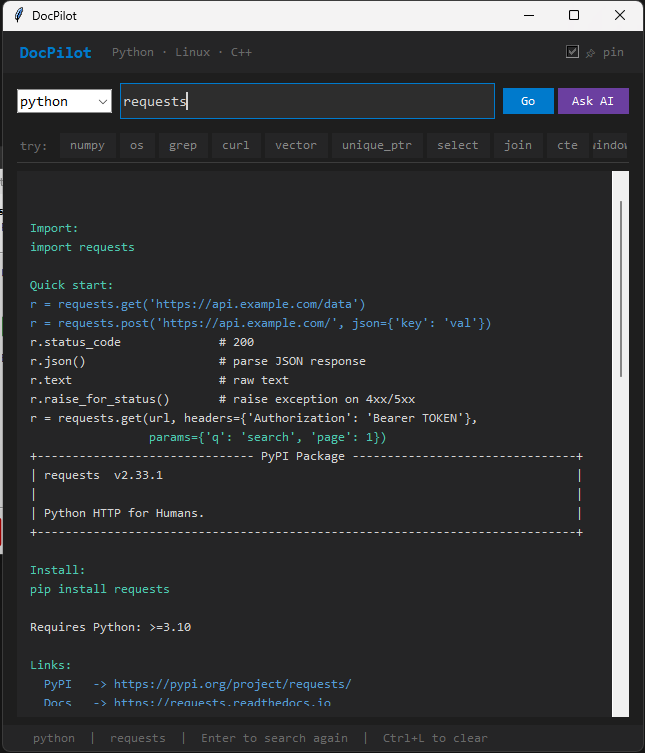

# DocPilot

> **[System Design](./systemdesign.md)** - Architecture, data flow, and how it works end-to-end

---


Instant terminal documentation for Python libraries, Linux commands, and C++ STL — while you code.

## What it does

- **Python** — looks up any PyPI package (version, install command, description, links) or any stdlib module via pydoc
- **Linux** — fetches live TLDR examples for any command + links to the full man page
- **C++** — built-in STL reference with include header and a ready-to-copy code example (no internet needed)
- **Search** — searches all three at once and shows a summary table

## GUI window (use alongside VS Code or Jupyter)

Double-click **`launch.bat`** to open a floating documentation window that stays on top of your editor.



- Pick a language from the dropdown, type what you want, press **Enter**
- Window floats over VS Code / Jupyter by default (click **📌 pin** to toggle)
- Click the quick buttons to try examples instantly
- **Ctrl+L** clears the search bar, **Esc** minimises

```bash
# or launch from the terminal (no console window)
pythonw gui.py
```

## AI-powered examples (optional)

DocPilot uses a local LLM via **Ollama** for two things:

- **Fallback examples** — if a package isn't in the built-in docs, it automatically asks the AI for code examples
- **Ask AI button** — in the GUI, click **Ask AI** to get an AI-generated explanation for any query

Preferred model is `gemma4`, but DocPilot will use any model you have installed (gemma3, gemma2, llama3, mistral, etc.).

### Setup Ollama (optional but recommended)

1. Download and install Ollama from [https://ollama.com](https://ollama.com)
2. Pull a model:
```bash
ollama pull gemma4
```
3. Make sure Ollama is running before launching DocPilot:
```bash
ollama serve
```

If Ollama is not running, DocPilot still works fine — AI features are silently skipped.

## Install

```bash
git clone https://github.com/sarthak-here/docpilot.git
cd docpilot
pip install -r requirements.txt
bash install.sh
source ~/.bashrc
```

## Usage

### Interactive mode (recommended)

```bash
docpilot
```

Starts a prompt where you can keep typing queries without restarting:

```
> cpp vector
> linux grep
> python requests
> search json
> list algorithm
> q
```

### One-shot mode

```bash
docpilot python <package>      # PyPI package or stdlib module
docpilot linux  <command>      # Linux command (TLDR)
docpilot cpp    <topic>        # C++ STL topic
docpilot search <term>         # search all three
docpilot list                  # all built-in C++ topics
docpilot list   <category>     # filter: container, algorithm, memory, thread...
```

## Examples

```bash
docpilot python numpy
docpilot python os              # stdlib module
docpilot linux grep
docpilot linux awk
docpilot cpp vector
docpilot cpp unordered_map
docpilot cpp unique_ptr
docpilot cpp sort
docpilot cpp regex
docpilot cpp chrono
docpilot search pandas
docpilot list
docpilot list algorithm
```

## C++ STL coverage

| Category | Topics |
|---|---|
| Containers | vector, array, deque, list, forward_list, stack, queue, priority_queue, map, multimap, unordered_map, set, multiset, unordered_set |
| Algorithms | sort, stable_sort, find, find_if, binary_search, lower_bound, upper_bound, count, copy, fill, transform, for_each, reverse, rotate, unique, remove, max, min, max_element, min_element, swap, next_permutation |
| Strings | string, string_view, stringstream |
| Memory | unique_ptr, shared_ptr, weak_ptr, make_unique, make_shared |
| I/O | cout, cin, cerr, fstream, ifstream, ofstream |
| Threading | thread, mutex, lock_guard, unique_lock, condition_variable, atomic, async, future |
| Utilities | pair, tuple, optional, variant, any, function, bind, move, forward, lambda |
| Other | chrono, filesystem, regex, span |

## Dependencies

```
requests
rich
beautifulsoup4
```
